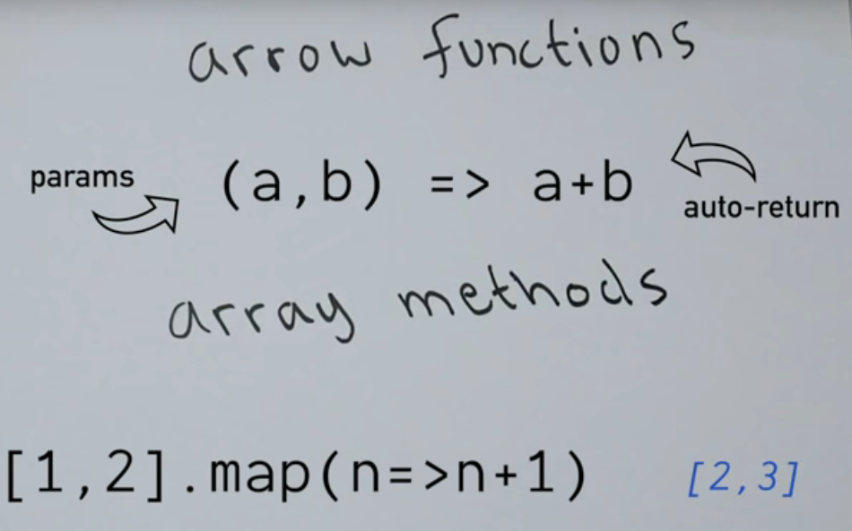
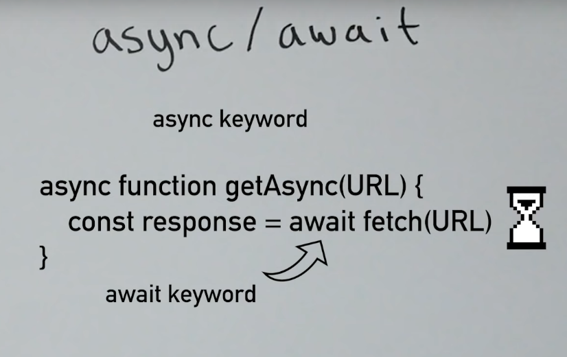

# JavaScript Basics

- ECMAScript standards, it stands for the European Computer Manufacturers Association (ECMA). Which gives standards to JS.
- Variables
  > Primitives are single self related like numbers, boolean, strings etc 
  > Compounds data are held as **arrays** **objects**
- We use let and const to declare variables 

- Arrays 
> const arr = [1,2,3]
> console.log(arr[0])

- Objects (also known dictionaries in other languages)
```js
const obj = {
  name: "Siat",
  email: "siat@ymail.com"
}
console.log(obj.name)
```

### DOM (Document object model)
- It's the JS representation of the structure of HTML and is present in the variable document when we load the page 
```
 document 
 {} like querySelector() 
 element
 {} {} {} like .addEventListener().style.color
```
 - All this is possible with the set of methods called the **Browser API**

### Other 
- Its a C like language, meaning it's most of the syntax came from C 
- It contains **if, while, for and more**

### Loop 
- we use **for in** loop to iterate object 
example
```js 
const obj = {
  name: "siat",
  age: 26
}
for(let key in obj) {
  console.log(key.obj[key]);
}
```
> Sample Output: 'name' 'siat' 'age' 26

- we use **for of** to iterate array
```js
let nums = [1,2,3,4]
for(let num of nums) {
  console.log(num)
}
```
> Sample output: 1 2 3 4 

### Functions 
- we declare functions by special keyword **function** after that name **add** and inside that we need to put the parameter 
```js
function add (first, second){
  return first+second;
}
add(1,2) // declare the function or use the function 
// here 1 2 are the arguments
```
### Methods 
- methods are same as functions
- that they are attached to different data types
```js
"hi" .toUpperCase() // HI
['c', 'b', 'a'] .sort()    // ['a', 'b', 'c']
[1,2,3] .indefOf(1) // 0
```

### Arrow Function 
- function can be written like this 
- now a days arrow functions are used most 


### Async Programming 
- we can say it's like performing **non-deterministic** operation
- Some important parts 
  - Network Request to server 
    > fetch(http:://server)
  - Callbacks, promises 

### Async Await 


### Typescript 
- It compiles into normal javascript
- It gives static variable 
- we need to mention variable type in TS

### NPM
- Node Package Manager
- We can use various packages with npm 