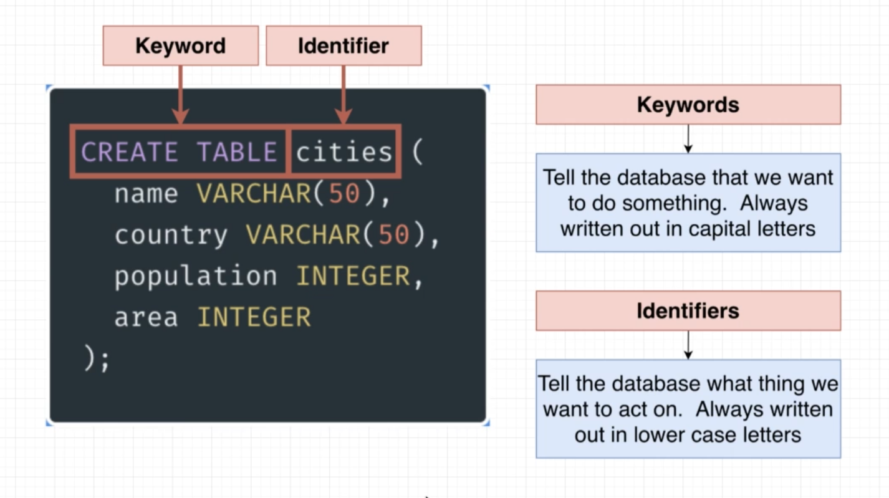
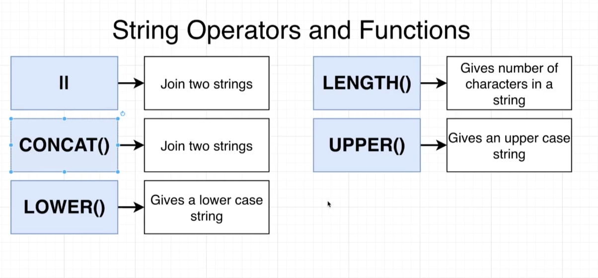

# PostgreSQL Notes
> Notes on PostgreSQL 

## Challenges of PostgreSQL 

- Writing efficient queries to retrieve information 
- Designing the schema, or structure of the database 
- Understanding when to use advanced features 
- Managing the database in a production environment

## Enterprise DB 

- Similar to postgresql but it has enterprise license. 
- Query and others are same. 
- Has a lots of features and customization abilities. 
- Backup and replication is hard but the features are very rich. 


## Query

- Table Creation
``` 
CREATE TABLE mobile (
	name VARCHAR(50),
	manufacturer VARCHAR(50),
	price INTEGER,
	unit_sold INTEGER
);
```

- Insert values into table 
```
INSERT INTO mobile(name, manufacturer, price, unit_sold)
VALUES 
	('iPhone 13 Pro', 'Apple', 1200, 9450),
	('Lumia 720', 'Nokia', 679, 1892),
	('Galaxy S22 Ultra', 'Samsung', 1100, 11435),
	('Poco X3', 'Xiaomi', 700, 10435),
	('Galaxy Note 10', 'Samsung', 1500, 8435),
	('Vivo V7', 'VIVO', 650, 3450),
	('Oppo Reno', 'Oppo', 1199, 2929);
```

- Query from table: **`SELECT * from mobile;`**

- Query specific values: **`SELECT price, unit_sold from mobile;`**

- Query and view data in order: 
```
select name, price, unit_sold, price * unit_sold as revenew from mobile order by revenew DESC;
```

### Analyzing CREATE TABLE 

- Here **CREATE TABLE** is a **`keyword`** and table name is an **`identifier`**.

- We always write keywords in capital and identifiers in small letter.


### String Operators and Functions

- These are used as operators and functions. 


### Show the running Query 
```
select query, query_start from pg_stat_activity
where username='db_user'
and client_addr='db_user_ip'
order by query_start desc
```
